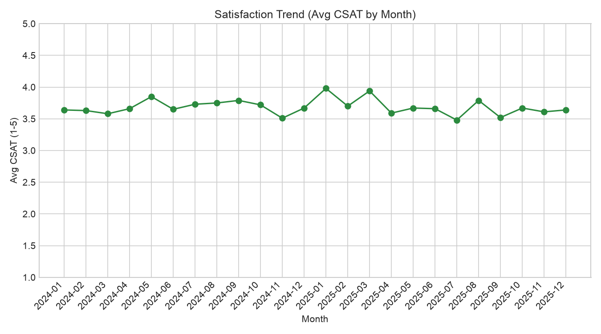
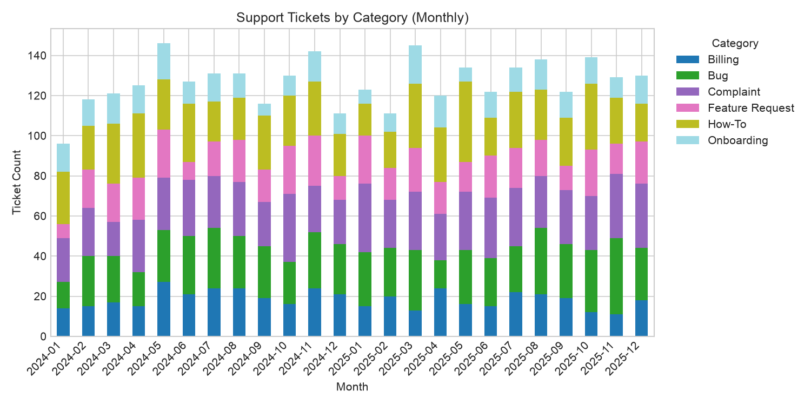
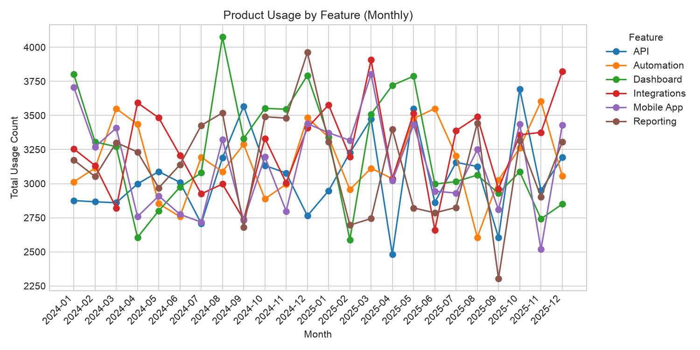
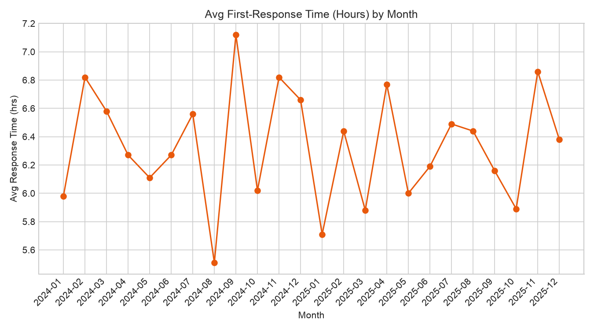

# Customer Success Analytics — SQL + Python

A portfolio project that simulates a SaaS company's **Customer Success** data
and uses **SQL + Python** to compute key metrics and generate charts,
the kind of dashboard a Customer Success or Ops team might rely on.

## What it does

The project generates a synthetic SQLite database of customers, support
tickets, satisfaction/NPS surveys, contract renewals, and product usage logs,
then runs SQL queries to compute:

### Top KPIs
| KPI | Description |
|---|---|
| **Customer Satisfaction (CSAT)** | Average satisfaction score from post-interaction surveys (1–5 scale) |
| **NPS** | Net Promoter Score — % Promoters (9–10) minus % Detractors (0–6) |
| **Renewal Rate** | % of contracts renewed vs. churned |
| **Tickets Closed** | Total number of resolved support tickets |

### Charts
| Chart | Description |
|---|---|
| **Satisfaction Trend** | Average CSAT over time |
| **Complaints** | Support ticket volume by category, month over month |
| **Product Usage** | Feature usage over time |
| **Response Time** | Average first-response time (hours) per month |

## Project structure
## Getting started

```bash
# 1. clone and install dependencies
git clone <your-repo-url>
cd customer-success-sql
pip install -r requirements.txt

# 2. generate the synthetic database (run once)
python data/generate_data.py

# optional: control how many customers get simulated (default: 150)
python data/generate_data.py --customers 500

# 3. run the KPI report + generate charts
cd src
python main.py
```

Sample output:
## Example charts






## Tech stack

- **Python 3** — data generation, orchestration, visualization
- **SQLite** — lightweight relational database
- **SQL** — all KPI and chart calculations (see `/sql`)
- **pandas** — query results → DataFrames
- **matplotlib** — chart rendering
- **Faker** — realistic synthetic customer names/data

## Notes on the data

All data is synthetically generated (seeded for reproducibility) and does
not represent any real company or customers. Ticket response/resolution
times, satisfaction scores, and renewal outcomes are randomly modeled with
realistic distributions and a small "sentiment bias" per customer so trends
look natural across time.

## Possible extensions

- Swap SQLite for PostgreSQL and connect via `psycopg2`
- Add a filter by `plan` or `industry` to KPIs/charts
- Build a Streamlit or Dash front-end on top of `src/kpis.py` and `src/charts.py`
- Add cohort-based renewal rate (renewal rate by signup month)
